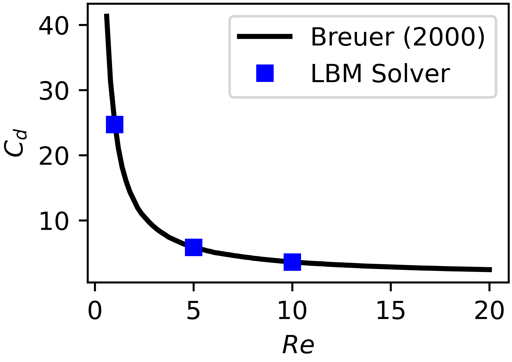
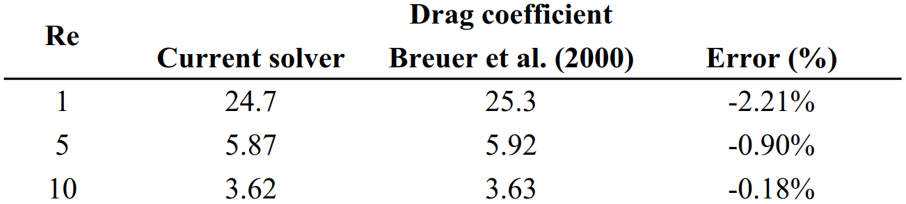
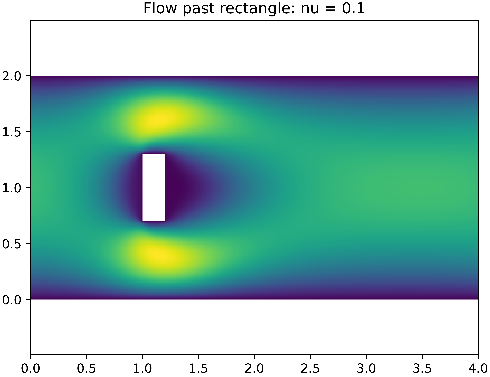
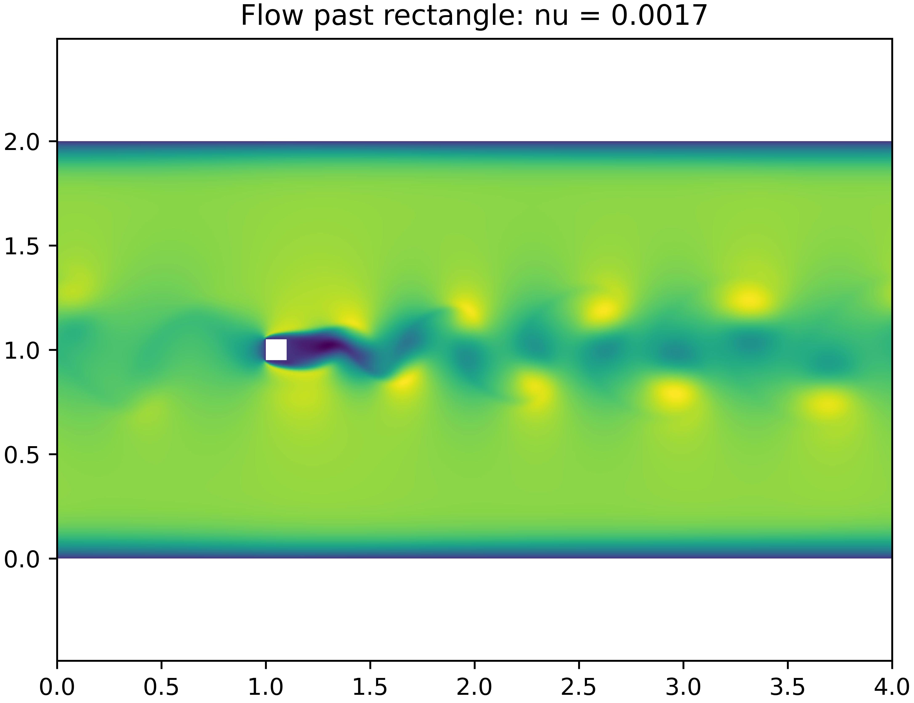

# GPU-accelerated Lattice Boltzmann Solver with MPI Support
GPU-accelerated Lattice Boltzmann Solver (D3Q19 lattice), with stand-alone versions written in C and Python, yielding identical results up to machine precision.

The C version uses OpenMP for cross-platform GPU offloading, and it has MPI support for large-scale simulations. The Python code includes a LBM solver written in PyTorch (CUDA) to verify results of the C code. 

## Physical simulation features
 - On-site pressure and velocity boundary conditions (automatically pre-generated for all X/Y/Z directions and face orientations).
 - Guo and Shan-Chen body force schemes.
 - Flows with moving boundaries.
 - Unsteady flows with advancing objects.
     - Object in case-study successfully crosses the periodic boundary.
 
## HPC features
 - Optimized C code with MPI support.
 - GPU-acceleration through OpenMP offloading, and direct MPI transfers between GPUs.
 - Smart reduction of MPI workload during halo exchanges, by avoiding data transfer of unnecessary lattice components (at boundaries).

## Formal validation
  - Successful replication of results from Breuer et al. (2000) regarding the changes in the drag coefficients (as a function of the Reynolds number) for the flow past a square cylinder within a channel:
      - M. Breuer, J. Bernsdorf, T. Zeiser, F. Durst (2000). Accurate computations of the laminar flow past a square cylinder based on two different methods: lattice-Boltzmann and finite-volume. International Journal of Heat and Fluid Flow, vol. 21, pp. 186-196.
 - Please see `validation_breuer_et_al_2000` subfolder.

## Test suite
 - Synthetic tests with Sine waves and Poiseuille flows, validating the order of accuracy of the code.
 - Comparison with respect to Ansys Fluent data for:
    - Gravity-driven flow past a square cylinder.
    - Flows past moving obstacles.
       - Steady-state tests, and transient flow with object crossing the periodic boundary.
 - Please see `tests_general` subfolder.

## How to use
 - Please consider the methodology presented in the subfolder `validation_breuer_et_al_2000` as a general example of how to use the C/Python code (initialize case folders, run code, post-process results).
 - C-version:
    - All the advanced test cases found in the `tests_general` folder (Python-based) can also be run with the C-version (each test case is 100% compatible). The C-code has to be compiled and run in the respective subfolder.
 - Python-version:
    - To run the validation cases from Breuer et al. (2000) in Python, please disable set the flag `only_export_inputs=False` in the file `python_lbm_validation_breuer_init.py`.
        - No further changes are needed. The post-processing code 

## Flow gallery
  - Flow past square cylinder and low and high Reynolds numbers ($Re$).
      - Von Karman vortices observed for high $Re$.
  - Flow with advancing obstacle.
      - Object successfully crosses the periodic boundary, without creating flow disturbances.

